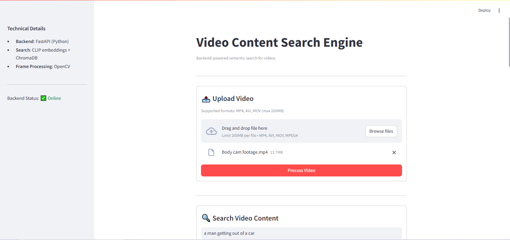
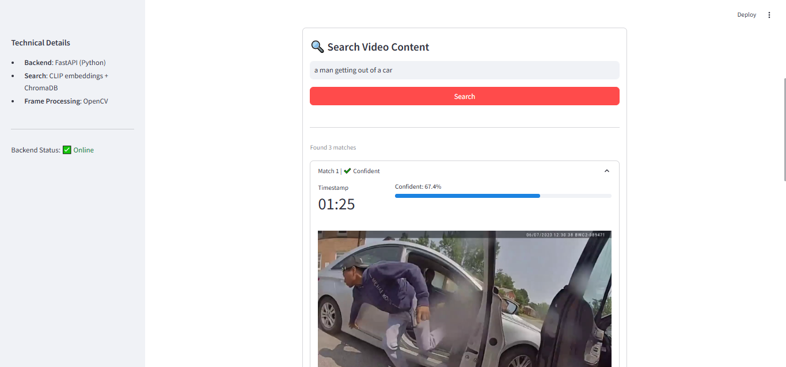

# Natural Language Video Query System

## 📚 Proof of Concept

A working back-end focused prototype demonstrating **natural language search** through video content by:

1. Converting video frames to vector embeddings (CLIP)
2. Storing embeddings in a vector database (ChromaDB)
3. Matching text queries against frames using semantic similarity

## 🔍 Core Innovation

**You can search videos using everyday language**:

- "A person getting out of a car"
- "Someone wearing a red shirt walking left"
- "Close-up of a dog's face"

_Note: Accuracy depends on CLIP's understanding of your query and video content quality_

## 🌍 Real-World Applications

This technology could help with:

**Security & Surveillance**:

- "Show me all people wearing red jackets in last week's footage"
- "Find every time someone entered the back door after hours"

**Media Production**:

- "Locate all smiling faces in interview footage"
- "Find establishing shots of city skylines"

**Personal Video Libraries**:

- "When did we open Christmas presents last year?"
- "Find clips of Sarah playing soccer"

_Current prototype limitations mean these would require scaling improvements_

## 📸 Interface Preview

### Video Upload

  
_Uploading a video file through the Streamlit interface_

### Search Results

  
_Example search results showing matching frames with confidence scores_

## 🛠️ Technical Implementation

### How It Works

1. **Frame Processing**:

   - Extracts 3 frames/second using OpenCV
   - Generates 512-dimension CLIP embeddings
   - Stores vectors + metadata in ChromaDB

2. **Multimodal Query Handling**:
   - Converts text to embedding using same CLIP model
   - Finds most similar frames via cosine similarity
   - Returns ranked results with confidence scores

### Technology Stack

- **Backend**: FastAPI + Pydantic
- **Embeddings**: CLIP-ViT-B/32
- **Vector DB**: ChromaDB (in-memory)
- **Frontend**: Streamlit

## 🧪 Testing Coverage

- Frame extraction reliability
- Embedding generation consistency
- Basic search functionality
- API response validation

```bash
pytest tests/  # Run all tests
```

## 🚀 Setup & Usage

1. Install requirements:

   ```bash
   pip install fastapi streamlit opencv-python chromadb transformers torch
   ```

2. Run system:

   ```bash
   uvicorn api:app --reload & streamlit run app.py
   ```

3. Try searching:
   - Upload a video (currently set to under 200MB)
   - Wait for processing
   - Enter natural language queries

## ⚠️ Current Constraints

1. **Performance**:

   - No batch processing
   - 3 FPS fixed sampling rate

2. **Accuracy**:
   - Limited by CLIP model capabilities
   - No temporal understanding
   - Basic confidence scoring

## 📂 Code Structure

```
.
├── api.py                # Main API endpoints
├── app.py                # Streamlit interface
├── core/                 # Core functionality
│   ├── database.py       # ChromaDB operations
│   ├── embedding.py      # CLIP embeddings
│   ├── models.py         # Data models
│   └── processor.py      # Video processing
├── tests/                # Test cases
└── storage/              # Temporary files
```

## 🔮 Next Steps

1. Better frame sampling strategies
2. Query refinement options
3. Basic temporal search support
4. Improved results visualization

---

_This prototype demonstrates the viability of natural language video search using current ML techniques. Contributions welcome._
